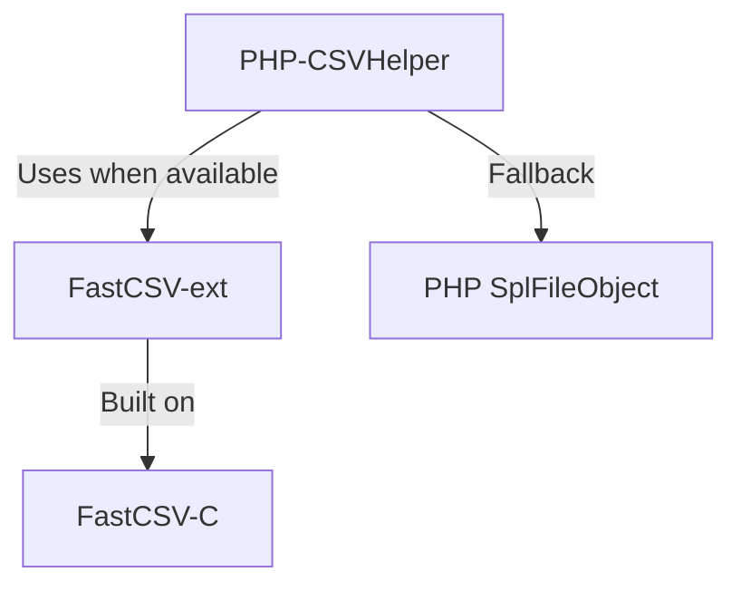

# CSVToolkit Organization

<div align="center">
  <h3>🚀 High-Performance CSV Processing Tools</h3>
</div>

## Our Projects

### [FastCSV-ext](https://github.com/csvtoolkit/FastCSV-ext)
A high-performance PHP extension for CSV file handling, providing significant improvements in speed and memory efficiency compared to PHP's native CSV functions.
- Built on top of FastCSV-C library
- Supports PHP 8.2, 8.3, and 8.4
- Cross-platform (Linux, macOS, Windows)
- MIT License

### [FastCSV-C](https://github.com/csvtoolkit/FastCSV-C)
A standalone, high-performance C library for CSV processing with minimal memory footprint.
- Zero dependencies
- Thread-safe design
- Cross-platform compatibility
- Powers the FastCSV PHP extension
- MIT License

### [PHP-CSVHelper](https://github.com/csvtoolkit/PHP-CSVHelper) ⭐
A modern PHP library that provides a unified interface for CSV processing, automatically using FastCSV when available.
- Automatic implementation selection
- Consistent API across implementations
- Fallback to native PHP when needed
- Type-safe with full PHP 8.1+ features
- MIT License

## Architecture



## Features

- **High Performance**: Optimized C implementation for maximum speed
- **Memory Efficient**: Minimal memory footprint for large files
- **Cross Platform**: Works on Linux, macOS, and Windows
- **Modern PHP**: Full PHP 8.x support with type safety
- **Flexible**: Custom delimiters, enclosures, and escape characters
- **Reliable**: Comprehensive test coverage
- **Open Source**: All components under MIT license

## Getting Started

1. For maximum performance:
   ```bash
   # Install the extension
   git clone --recursive https://github.com/csvtoolkit/FastCSV-ext
   cd FastCSV-ext
   phpize
   ./configure
   make
   make install
   ```

2. For a unified API with automatic fallback:
   ```bash
   # Install via Composer
   composer require csvtoolkit/csv-helper
   ```

## Contributing

We welcome contributions to any of our projects! Each repository has its own contribution guidelines and development setup instructions.

## License

All projects under the CSVToolkit organization are released under the MIT License. 