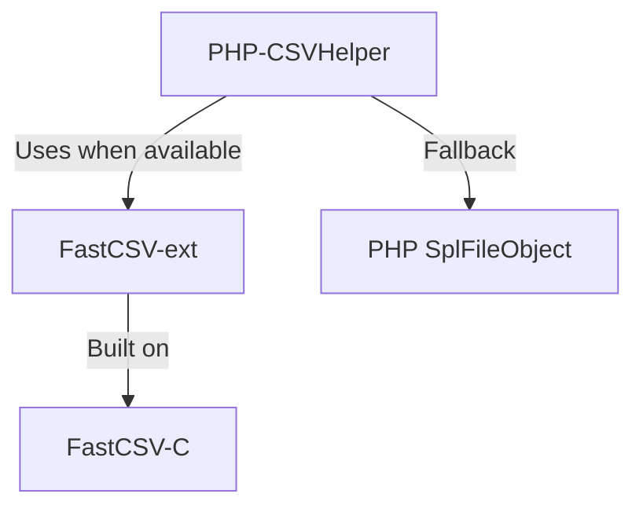

# CSVToolkit Organization

  <h3>🚀 High-Performance CSV Processing Tools</h3>

> ⚠️ **Experimental Status**: These projects are currently in experimental phase. While they work correctly and pass all tests, please use with caution in production environments. We recommend thorough testing in your specific use case before deployment.

## Our Projects

### [FastCSV-ext](https://github.com/csvtoolkit/FastCSV-ext)
A high-performance PHP extension for CSV file handling, providing significant improvements in speed and memory efficiency compared to PHP's native CSV functions.
- **4-7x faster** than native PHP CSV functions (validated by benchmarks)
- **Read Performance**: Up to 383K records/sec vs 82K records/sec (SplFileObject)
- **Write Performance**: Up to 692K records/sec vs 109K records/sec (SplFileObject)
- Built on top of FastCSV-C library
- Supports PHP 8.2, 8.3, and 8.4
- Cross-platform (Linux, macOS, Windows)
- MIT License

### [FastCSV-C](https://github.com/csvtoolkit/FastCSV-C)
A standalone, high-performance C library for CSV processing with minimal memory footprint.
- Zero dependencies
- Thread-safe design
- Cross-platform compatibility
- Powers the FastCSV PHP extension
- MIT License

### [PHP-CSVHelper](https://github.com/csvtoolkit/PHP-CSVHelper)
A modern PHP library that provides a unified interface for CSV processing, automatically using FastCSV when available.
- **Intelligent Performance**: Automatically uses FastCSV (4-7x faster) when available
- **Reliable Fallback**: Falls back to optimized SplFileObject implementation
- **Memory Efficient**: Constant memory usage with streaming for datasets of any size
- Automatic implementation selection
- Consistent API across implementations
- Type-safe with full PHP 8.2+ features
- MIT License

### [Benchmarking PHP FastCSV](https://github.com/csvtoolkit/benchmarking-php-fastcsv)
A comprehensive benchmarking suite for comparing FastCSV extension performance against native SplFileObject implementation.
- Docker-based environment for consistent testing
- Multiple data sizes (1K, 100K, 1M records)
- Automated performance measurement and reporting
- Validates the 4-7x performance improvement claims
- MIT License

## Architecture

## Features

- **High Performance**: Optimized C implementation for maximum speed
- **Memory Efficient**: Minimal memory footprint for large files
- **Cross Platform**: Works on Linux, macOS, and Windows
- **Modern PHP**: Full PHP 8.x support with type safety
- **Flexible**: Custom delimiters, enclosures, and escape characters
- **Reliable**: Comprehensive test coverage
- **Open Source**: All components under MIT license

## Contributing

We welcome contributions to any of our projects! Each repository has its own contribution guidelines and development setup instructions.

## License

All projects under the CSVToolkit organization are released under the MIT License. 

## Support the Project

If you find CSVToolkit useful for your projects, please consider sponsoring the development! Your support helps maintain and improve these high-performance CSV tools while reducing development and infrastructure costs.

**Why sponsor?**
- 🚀 Accelerate development of new features
- 🐛 Faster bug fixes and improvements  
- 📚 Better documentation and examples
- 🎯 Priority support for feature requests
- 💡 Fund research into even faster CSV processing techniques
- 💰 **Lower development costs** - Reduce your team's time spent on CSV processing optimization
- 🏗️ **Reduce infrastructure costs** - More efficient processing means lower server resources needed
